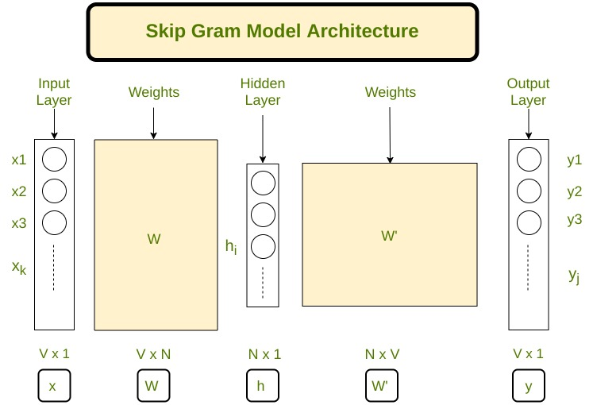

# Word2Vec-Algorithm-From-Scratch

#### Write code to implement the skip-gram model of word2vec using python. You should write code to read input from a text file, train on the word2vec algorithm, save #### the word embeddings for each word, and finally validate the embeddings calculated by using cosine similarity.

### Steps (for guideline purposes only):

##### 1) Build the corpus vocabulary
##### 2) Apply pre-processing
##### 3) Build one-hot encodings for target and context words
##### 4) Build a neural network with two weight matrices W (between input layer
##### and the hidden layer) and W' (between the hidden layer and the output
##### layer). W' stodes the embeddings
##### 5) Make number of neurons in the hidden layer equal to the size of the word vectors
##### 6) Train the model with the target word as input and the output being the
##### probability of all the words in the vocabulary being the potential context words. Calculate the loss and update the weights
##### 7) Get 2 word embeddings for each word by indexing into the input matrix W and the transpose of context matrix W'
##### 8) Write a function to find cosine similarity between vectors of any two words
